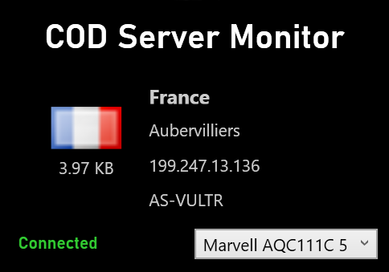

# Call of Duty Server Monitor (CSM)

A lightweight Windows application that displays Call of Duty server connection details in real-time. This tool helps players make informed decisions about their server connections, especially useful in Call of Duty: Black Ops 6 where server latency information isn't visible in the lobby.

### Main View

### Overlay mode

## Features

- 🌍 Real-time server location information (Country & City, IP, ASN)
- 📊 Network traffic monitoring
- ⚡ Minimal performance impact
- 🖱️ Draggable window interface
- 📌 Overlay and "Always on Top" options
- 🔄 Automatic network interface detection

## Requirements

- Windows Operating System
- [Npcap](https://npcap.com/#download) installed on your system
- Call of Duty: Black Ops 6 (or other supported Call of Duty titles)

## Installation

1. Download the latest release from the [Releases](https://github.com/d3skdev/CSM/releases) page
2. Install Npcap if you haven't already ([Download Npcap](https://npcap.com/#download))
3. Extract the downloaded ZIP file
4. Run CSM.exe

## Usage

1. Launch Call of Duty
2. Run CSM
3. Join a lobby or match
4. The application will automatically display server information

### Network Interface Selection
- The application automatically attempts to detect the correct network interface
- If server information is not displaying correctly, use the dropdown menu to select your active network interface
- Common interfaces are:
  - Ethernet for wired connections
  - Wi-Fi for wireless connections

### Additional Features
Right-click on the application window to access:
- Toggle Overlay
- Toggle Always on Top
- Exit Application

## Important Notes

- This application requires administrator privileges to monitor network events
- This application only monitors Call of Duty network traffic and doesn't modify any game files
- The information displayed in this app can also be found in:  
`Task Manager > Resource Monitor > Network tab`,
but this app presents it in a more convenient and game-specific format

## Troubleshooting

- If no server information is displayed:
  - Verify that the correct network interface is selected in the dropdown menu
  - Ensure the game is running and you are in a lobby or match
  - Check if you have administrator privileges
  - Verify that Npcap is properly installed

## Privacy

This application only monitors the network traffic between your device and Call of Duty servers. It works completely offline - it doesn't connect to any external servers, doesn't collect any personal data, and doesn't send anything over the internet. Everything happens locally on your PC.

## Credits

This application uses MaxMind's GeoLite2 databases for IP geolocation. GeoLite2 files are sourced from [P3TERX/GeoLite.mmdb](https://github.com/P3TERX/GeoLite.mmdb).

## Disclaimer

This project is not affiliated with, maintained, authorized, endorsed, or sponsored by Activision or any of its affiliates. 